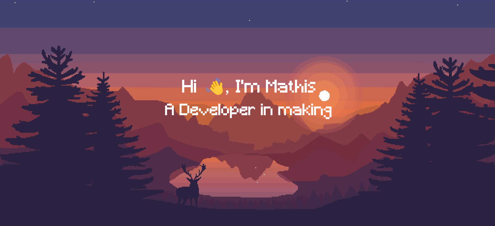

---
### I am currently a 3rd year student at the [USMB](https://www.univ-smb.fr/) !

- 🔭 I’m currently working on USMB SDP Project
- 🌱 I’m currently learning **Flutter**
- 👨‍💻 All of my projects are available at [https://realdragonma.fr](https://realdragonma.fr)

#### 📫 Reach me
- Discord : Mathis#6004
- Website : [here !](https://realdragonma.fr)

Passionate about programming, I try to be interested in as many technologies as possible!
I like to make projects and touch all possible domains: conception, design, programming, deployment, etc.
Although what I prefer is the backend aspect !

    

---

<h1 align="center">
:wrench: Languages & Tools :hammer:
</h1>

<h1 style="display: inline-block;">NO LINE</h1>

    <a href="https://skillicons.dev">
        
         
        
    </a>

    

    

<h2 align="center">📜 My Github Stats 📜</h2>

    
    

